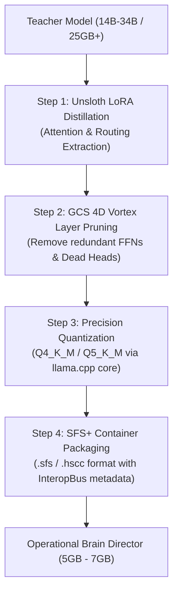

# 🧠 Brain Director Model Maker (BMRAD Engine) & Model Guidelines

### *Architectural Standards, Distillation Pipeline, and Runtime Interoperability*

---

## 1. 🌟 Executive Overview

The **Brain Director Model Maker (BMRAD Engine)** is the supervisory intelligence layer of Hyper-Spherical Systems (HypeS). Rather than running massive, monolithic models that consume entire GPUs simply to perform tool routing, reasoning verification, and prompt orchestration, HypeS separates high-level governance from raw generation.

A **Brain Model** acts as an autonomous governor:
* **Supervises Execution:** Monitors generation in real time, detecting repetitive token traps and hallucinations before they cascade.
* **Orchestrates the Mesh:** Routes sub-tasks to specialized domain models across the **SFS+ InteropBus** via `GROW_FROM` and `GROW_WITH` directives.
* **Governs Speculative Decoding:** Manages draft token prediction passes and dynamically throttles drafting depth if hardware latency spikes.
* **Normalizes Intent:** Bridges multilingual user input into unified semantic representations for English-focused or domain-specific models.

---

## 2. 🎯 The 5GB–7GB Supervisory Sweet Spot

Through extensive empirical testing across diverse hardware topologies (from zero-CUDA Intel Core i7 / AMD Ryzen 9 systems to dual-NVMe multi-GPU workstations), we identified the **5GB to 7GB quantized weight envelope** (approx. 7B to 9B parameters at `Q4_K_M` or `Q5_K_M`) as the ideal supervisory sweet spot:

| Metric | < 3B Parameter Models | **5GB – 7GB Sweet Spot (7B – 9B)** | > 14B Parameter Models |
| :--- | :--- | :--- | :--- |
| **VRAM / RAM Footprint** | 1.8 GB – 2.5 GB | **4.3 GB – 6.8 GB (Fits comfortably alongside base models)** | 10 GB – 24 GB+ (Saturates memory bus) |
| **Instruction Following** | Weak under complex multi-step tool calls | **Near-frontier adherence to strict JSON schemas** | Frontier adherence, but excessive memory penalty |
| **Multilingual Intent Normalization** | Prone to translation drift and syntax corruption | **High polyglot fluency across 30+ languages** | High fluency, but too slow for real-time supervisory loop |
| **Token Overhead / Latency** | < 15 ms / token | **20 – 35 ms / token (Perfect for draft token gating)** | > 70 ms / token (Bottlenecks speculative flow) |
| **Hallucination Rejection** | Modest self-verification capability | **High-confidence cross-entropy consensus verification** | High confidence, but redundant for pure routing |

### Recommended Candidate Brain Models (Quantized to 5GB – 7GB)
1. **Qwen-2.5-Coder-7B-Instruct** (`~4.68 GB` at `Q4_K_M`): Unrivaled JSON schema compliance, tool-calling precision, and architectural reasoning.
2. **Llama-3.1-8B-Instruct** (`~4.92 GB` at `Q4_K_M`): Superior multilingual intent extraction, dialogue steering, and conversational composure.
3. **Gemma-2-9B-IT** (`~5.86 GB` at `Q4_K_M`): High reasoning density, formal logic parsing, and anti-repetition resilience.
4. **DeepSeek-Coder-V2-Lite-16B (vMoE)** (`~9.12 GB` at `Q4_K_M`): High polyglot coding power for multi-model developer workstations.
5. **Mistral-7B-Instruct-v0.3** (`~4.37 GB` at `Q4_K_M`): Ultra-low latency, aggressive attention pruning, and fast draft validation.

---

## 3. 🔬 Distillation & Compression Pipeline (25GB+ $\to$ 5GB–7GB)

To convert large monolithic models (14B–34B, 25GB+) into agile Brain Director models, follow the BMRAD 4-step pipeline:



### Step 1: Distillation of Attention & Routing
* Extract supervisory attention weights using Unsloth or LoRA fine-tuning.
* Train primarily on:
  * Multi-turn tool invocation and parameter validation datasets.
  * Polyglot intent normalization (mapping Spanish, French, German, Mandarin, Japanese, etc., to canonical English tool schemas).
  * Self-consistency reasoning traces and loop-detection tokens.

### Step 2: GCS 4D Vortex Layer Pruning
* Load weights into the **Golden Candy Spinner (GCS v6.0)**.
* Run layer correlation analysis: identify and prune feed-forward network (FFN) blocks that exhibit high cosine similarity or near-zero variance.
* Preserve 100% of early-layer attention projection heads (essential for prompt parsing) and late-layer router matrices.

### Step 3: Calibrated Quantization
* Quantize using Pirate Llama's native engine (`llama.cpp` port).
* Target `Q4_K_M` or `Q5_K_M` with importance matrix (`imatrix`) calibration on technical and multilingual evaluation splits.

### Step 4: SFS+ Containerization
* Package into an `.sfs` / `.hscc` container with embedded metadata:
  * Enabled tools (`python_repl`, `system_shell`, `vision_api`, `peer_mesh`).
  * 5D OCEAN personality default spark vectors.
  * Speculative drafting configuration bounds.

---

## 4. ⚡ Dynamic Speculative Decoding Auto-Optimizer

Speculative decoding pairs a fast draft predictor (either the Brain Model or an ultra-compact draft head) with the primary generative model. While speculative drafting can achieve up to **2.5× to 3.8× throughput speedups**, draft token rejection can severely penalize throughput if system latency spikes or if the model enters divergent reasoning.

### The Dynamic Auto-Optimizer Algorithm
The BMRAD Engine implements an **Adaptive Draft Token Governor**:

```
Let K = Speculative Draft Depth (default = 4, range = 1..8)
Let A = Moving average acceptance rate of draft tokens (window = 32 tokens)
Let L = Measured P95 latency per draft verification pass (ms)
Let L_max = Hardware latency ceiling (ms, determined during boot calibration)

Every generation burst:
    If A >= 0.75 and L < L_max:
        K = min(K + 1, 8)          # High accuracy & fast hardware -> Scale up drafting
    Else if A < 0.60 or L >= L_max:
        K = max(K - 2, 1)          # Low acceptance or latency spike -> Back off drafting immediately
    Else if A < 0.40:
        K = 1                      # Rejection cascade -> Drop to pure single-pass generation
```

* **Zero Latency Regression:** If the system is running on low-spec hardware or experiencing background CPU/NVMe load, draft passes are dynamically throttled down to $K=1$, guaranteeing that speculative decoding never runs slower than baseline inference.
* **4D Angular Loop Breaker:** If token generation enters an unvarying cyclical pattern for more than 3 iterations, the loop breaker injects an orthogonal angular phase shift into the logits, forcing the sampler toward novel semantic paths.

---

## 5. 🏴‍☠️ Pirate Llama Runtime Requirement (SFS & SFS+ Models)

> [!IMPORTANT]
> **To run SFS or SFS+ models, Pirate Llama MUST be installed and functional.**  
> SFS and SFS+ are proprietary 4D bladed vortex containers that require Pirate Llama's dedicated container runtime, virtual memory layer streamer, and SFS+ InteropBus mesh manager.

### Running SFS / SFS+ Models via LM Studio (Universal Endpoint)
While Pirate Llama is required under the hood to manage and unpack SFS/SFS+ models, **you are never locked into a single interface**. If you prefer the LM Studio GUI:

1. Ensure Pirate Llama is installed and running (`python gui/server.py` or double-click **Hyper-Spherical Control Center**).
2. Pirate Llama exposes an OpenAI-compatible **Universal Endpoint** on:
   ```
   http://localhost:8000/v1
   ```
   *(Or on port `1234` in LM Studio Drop-In mode).*
3. In **LM Studio**:
   * Navigate to **Settings** $\to$ **Connect to External API Server** (or Developer / Custom Endpoint).
   * Enter the endpoint URL: `http://localhost:8000/v1`.
   * Set API Key: `hypes-sovereign-key` (or leave blank if local loopback auth is enabled).
   * Click **Test Connection**. LM Studio will immediately populate with all loaded SFS and SFS+ models!
4. Select your SFS+ model in LM Studio and chat as usual. Pirate Llama intercepts the prompt, applies **ISSI 10× token compression**, runs the SFS+ container engine, and streams the output directly back into the LM Studio window.
5. The **Golden Token HUD** will auto-detect LM Studio, suction-dock to its window, and display real-time token compression and cost savings on screen.

---

## 6. 🦙 Native GGUF Execution (Built on llama.cpp)

> [!TIP]
> **Full llama.cpp Feature Parity & Replacement:**  
> Because Pirate Llama's execution core was ported directly from `llama.cpp`, **Pirate Llama runs standard `.gguf` models natively with zero external dependencies.**

* If you do not want to run `llama.cpp` separately, **you do not have to**. Pirate Llama is a 100% native drop-in replacement.
* All original `llama.cpp` capabilities are fully preserved:
  * Full GPU offloading (CUDA, ROCm, Metal, Vulkan).
  * Zero-CUDA CPU layer streaming (AVX2, AVX-512, NEON).
  * Standard sampling controls: Temperature, Top-P, Min-P, Repeat Penalty, Mirostat.
* **Plus HypeS Built-In Superpowers:**
  * **ISSI Token Compression:** Up to 10× reduction in repetitive prompt tokens.
  * **4D Angular Loop Breaker:** Automated prevention of repetitive degeneration loops.
  * **Pre-Run Model Inspector:** Visual sliders and brain model attachment before execution.
  * **Golden Token HUD Integration:** Live telemetry, dollar savings, and multi-port proxying.

---

## 7. 🗺️ Feature Status Matrix (Active vs. Work In Progress)

To keep the developer and open-source community fully informed, the following matrix outlines what is live and functional vs. what is currently in active R&D:

| Feature / Subsystem | Current Status | Description |
| :--- | :---: | :--- |
| **Pirate Llama Universal Endpoint (`/v1`)** | ✅ **ACTIVE** | Consolidated proxy for Ollama, LM Studio, llama.cpp, and Cloud backends. |
| **Native GGUF Inference Engine** | ✅ **ACTIVE** | Full native `llama.cpp` port running all GGUF models out of the box. |
| **SFS / SFS+ Container Runtime** | ✅ **ACTIVE** | Secure container sandbox, permission gating, and layer streaming. |
| **LM Studio Universal Loopback** | ✅ **ACTIVE** | Route SFS/SFS+ models through LM Studio via `http://localhost:8000/v1`. |
| **Golden Token HUD (v7.0)** | ✅ **ACTIVE** | Frameless floating HUD, Radar search & seek, Antigravity IDE live link. |
| **Golden Candy Spinner (GCS v6.0)** | ✅ **ACTIVE** | Hugging Face GGUF hub integration, 1-click model pull, and .hscc packager. |
| **Pre-Run Model Inspector Dialog** | ✅ **ACTIVE** | Pre-execution GUI for draft passes, loop breaking, brain binding, and 5D OCEAN traits. |
| **Dynamic Speculative Auto-Optimizer** | 🚀 **WIP (Beta)** | Real-time draft pass back-off during latency spikes (active in `model_inspector_dialog.py`). |
| **BMRAD 25GB $\to$ 5GB Automated Distiller** | 🚀 **WIP (Beta)** | LoRA extraction pipeline running via `tools/brain_builder.py` and `The Sauna`. |
| **Cross-Model SFS+ InteropBus Skill Mesh** | 🚀 **WIP (Beta)** | Peer-to-peer peer discovery active; multi-node clustering in development. |
| **4ID Procedural 3D Avatar Engine** | 🔮 **ROADMAP** | Real-time full-duplex voice STT/TTS connected; 3D facial mesh in development. |

---

<div align="center">
  <b>Hyper-Spherical Systems — Grind down the limits.</b><br>
  <i>For questions, benchmark submissions, or pull requests, visit <a href="https://github.com/thomasjosh1981/Hyper-Spherical-Systems">GitHub Repository</a>.</i>
</div>
