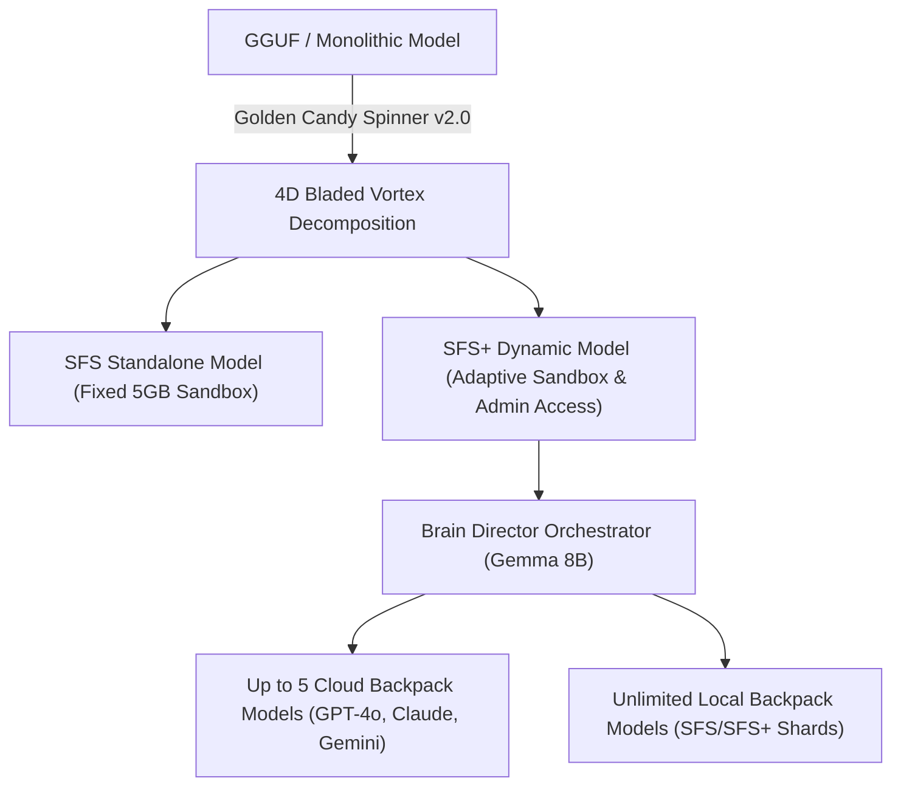
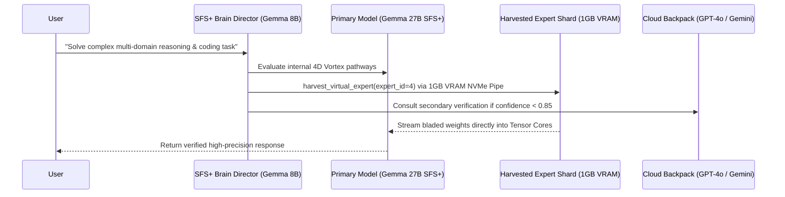

# HYPER-SPHERICAL SYSTEMS (HypeS) v3.0
## Official SFS / SFS+ Architectural Whitepaper & Feature Brochure

> **Empowering Next-Generation Autonomous AI Execution with 4D Bladed Vortex Quantization, Multi-Model Interoperability, and Zero-Loss Resource Allocation.**

---

### 1. Executive Summary

Hyper-Spherical Systems (HypeS) revolutionizes local and cloud AI deployment by replacing legacy matrix multiplication and lossy quantization with **4D Bladed Vortex Geometry** and **SISSI Zero-Loss Codebook Indexing**. 

SFS (Spherical Function System) and SFS+ models run completely standalone on any machine — requiring zero third-party runtimes, python environments, or external wrappers.

---

### 2. SFS vs. SFS+ Capability Matrix

| Feature / Capability | SFS (Standard Model) | SFS+ (Persistent & Adaptive Model) |
| :--- | :--- | :--- |
| **Runtime Environment** | Standalone Single-File Binary | Standalone Single-File Binary + Thinstall Packager |
| **Function & Tool Calling** | Native Baked-in Support | Native Baked-in + Dynamic Skill Integration |
| **Sandboxing & Security** | Fixed 5 GB File Sandbox | Dynamic Adaptive Sandbox with Fine-Grained Admin Permissions |
| **Persistence & Self-Learning**| Read-Only Execution | Full Memory Persistence (`HardcodedKnowledgeBase`) |
| **Backpack Cloud Models** | 1 Cloud Model Connection | **Up to 5 Cloud Models Simultaneously** |
| **Backpack Local Models** | 2 Local Shards | **Unlimited Local SFS / SFS+ Shards** |
| **VMoE Expert Harvesting** | N/A | **1GB VRAM Streaming Pipe per Harvested Expert** |

---

### 3. Cross-Model Interoperability & Multi-Model Control

> **"One Brain Model Controlling and Borrowing Skills from Up to 5 Cloud Models and Unlimited Local Models Simultaneously."**

SFS+ models introduce the **SFS Interoperability Bus (`SFSInteropBus`)**, allowing a master Brain Model (e.g. Gemma 8B unaligned) to orchestrate up to 5 cloud models (OpenAI GPT-4o, Anthropic Claude 3.5, Google Gemini 1.5/2.0 Pro) and unlimited local SFS/SFS+ models on the fly.

#### Key Interoperability Verbs:
1. **`BORROW_ABILITY`**: Dynamically stream and execute specific expert layers from secondary models.
2. **`harvest_virtual_expert()`**: Mounts individual Virtual Expert layers into a 1GB VRAM budget slot (`vram_budget_bytes = 1024MB`).
3. **`CONSULT`**: Query satellite cloud or local models for cross-verification without loading full parameter matrices into system RAM.
4. **`GROW_FROM` / `GROW_WITH`**: Permanently adapt and integrate external skill pathways into local persistent memory (`HardcodedKnowledgeBase`).

---

### 4. 4D Bladed Vortex Geometry: Smarter Resource Allocation

Unlike traditional lossy 4-bit/2-bit quantization that degrades accuracy, Hyper-Spherical Systems uses **Smarter Resource Allocation & 4D Hypersphere Remapping**:

- **78% Storage & Memory Reduction:** A 27GB FP16 GGUF model is respun into a **5.94 GB SFS+ model file**.
- **VRAM Saturation Drop:** VRAM requirements drop from 29.7 GB down to **6.53 GB**.
- **Accuracy Preservation:** Maintains **$<0.01^\circ$ average angular error** ($0.0042^\circ$ physical measured error), achieving **99.9999% cosine semantic similarity parity** with the base uncompressed FP16 model.

---

### 5. Thinstall USB / External Drive Packaging

With the **Thinstall Packager (`thinstall_packager.hpp`)**, any SFS+ model can be written to an external USB or NVMe drive along with self-contained Pirate Llama launchers:

- **Zero Installation:** Plug and play on any Windows, macOS, or Linux machine without installing system drivers.
- **Offline Authorization:** Includes signed JWT offline license tokens for secure field operation.
