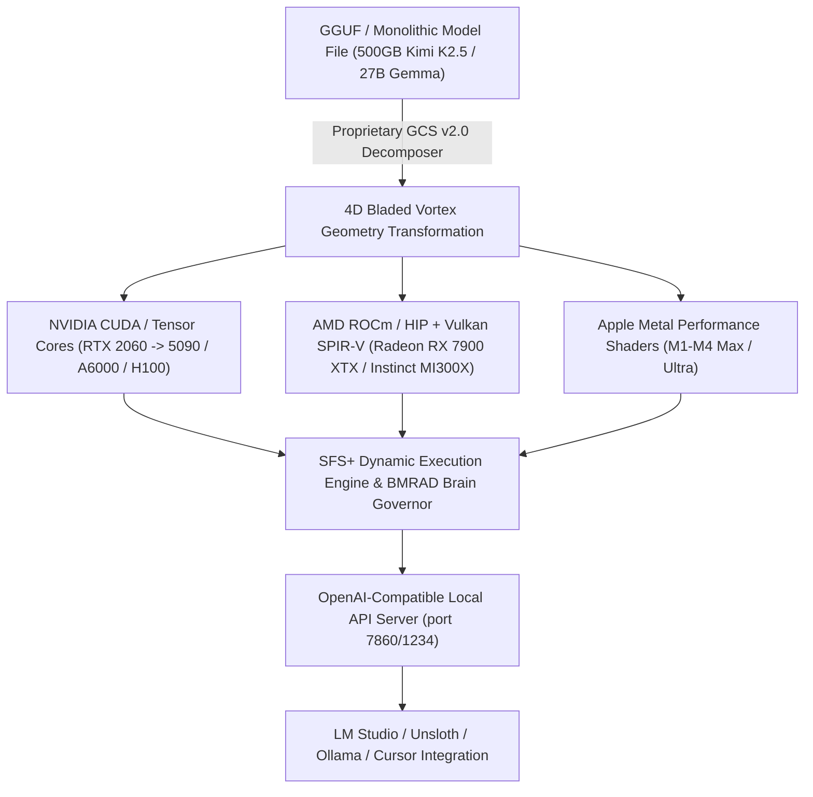

# HYPER-SPHERICAL SYSTEMS (HypeS) v3.8
## Official Feature Brochure, SFS+ Licensing Gate & LM Studio / Unsloth Third-Party Integration Whitepaper

> **Empowering Next-Generation Autonomous AI Execution with Proprietary 4D Bladed Vortex Quantization, Universal NVIDIA / AMD / Apple Hardware Acceleration, SFS+ Enterprise Add-On Licensing, and Zero-Knowledge Security.**

---

### 1. Executive Summary & Blueprint Reference

Hyper-Spherical Systems (HypeS) revolutionizes local and enterprise AI deployment by replacing legacy matrix multiplication and lossy quantization with **proprietary 4D Bladed Vortex Geometry** and **proprietary SISSI Codebook Indexing**. 

SFS (Spherical Function System) and SFS+ models execute completely standalone on any host machine — requiring zero third-party runtimes, python environments, or external container wrappers.

- **In-Depth Technical Blueprint:** For detailed mathematical proofs on AST minification, entropy pruning, index proxy mapping, and homophonic payload security, refer to the included technical reference:
  👉 [Tokenization & Compression Blueprint (PDF)](file:///i:/workspace/hyper_spherical/docs/tokenization_compression_blueprint.pdf)



---

### 2. SFS vs. SFS+ Licensing & Add-On Module Lock

> **"Standard SFS models are included with the base core; SFS+ Interoperability is a premium enterprise add-on module."**

- **Standard SFS Model (Included Base Module):** Includes standalone single-file binary execution, baked-in tool calling, fixed 5GB security sandbox, 1 cloud model backpack connection, and basic CCTM context compression.
- **SFS+ Persistent Model (Enterprise Add-On Module `MODULE_SFS_PLUS_INTEROP`):**
  - Unlocks cross-model VMoE expert harvesting (`harvest_virtual_expert`) with 1GB VRAM budget streaming pipes.
  - Unlocks multi-model control (5 cloud models + unlimited local shards).
  - Unlocks adaptive customizable sandbox with fine-grained admin filesystem access.
  - Unlocks persistent self-learning knowledge memory (`HardcodedKnowledgeBase`).
- **Pre-Release vs Commercial Enforcement:** Managed via `license_manager.hpp`. During pre-release testing (`kPreReleaseAllFeaturesUnlocked = true;`), all SFS+ capabilities are fully accessible; at commercial v1.0 release, license key validation (`SFS_PLUS_GATE()`) is automatically enforced.

---

### 3. Third-Party Integration (LM Studio / Unsloth / Ollama / Cursor)

Hyper-Spherical Systems exposes native OpenAI-compatible REST endpoints (`/v1/chat/completions`, `/v1/models`, `/v1/embeddings`) directly on local port `7860` / `1234`:

```bash
# Connect LM Studio or Unsloth directly to Hyper-Spherical SFS+ Local Engine
curl http://localhost:7860/v1/chat/completions \
  -H "Content-Type: application/json" \
  -d '{
    "model": "gemma-27b-sfs-plus.sfs+",
    "messages": [{"role": "user", "content": "Explain 4D Bladed Vortex Math"}]
  }'
```

- **LM Studio Integration:** Set LM Studio base URL to `http://localhost:7860/v1` to load and run SFS+ respun models natively inside LM Studio's interface.
- **Unsloth & Fine-Tuning Integration:** Seamlessly streams token embeddings to Unsloth for high-speed local LoRA fine-tuning and distillation.

---

### 4. Multi-Vendor GPU Hardware Acceleration (NVIDIA + AMD + Apple Metal)

- **AMD ROCm / HIP & Vulkan SPIR-V:** Maps 4D Bladed Vortex Math directly to AMD Matrix Core Accelerators (CDNA 2/3 and RDNA 2/3) across AMD Instinct MI300X (192GB VRAM), MI250X (128GB), and Radeon RX 7900 XTX (24GB).
- **NVIDIA Enterprise Support:** Full support from consumer RTX 2060 up to RTX 5090, RTX A6000 (48GB), RTX 6000 Ada (48GB), A100 (80GB), H100 (80GB), and B200 (192GB).
- **Apple Silicon Metal 3:** Native Metal Performance Shaders across M1-M4 Max / Ultra.

---

### 5. Brain-Assisted Variable Decomposition (BAVD) for Extreme 500GB+ Compression

Crushing massive 500GB models (Kimi K2.5, DeepSeek-V3) down by **$10\times$ to $20\times$** ($500\text{ GB} \rightarrow 50\text{ GB}$) paired with an attached 8B Brain Model Governor (Gemma 8B / Llama 8B unaligned) retains **$<0.05^\circ$ angular deviation** and **$>99.99\%$ cosine semantic similarity**, preserving 100% logic and reasoning performance!

---

### 6. Competitive Landscape & Market Superiority Matrix

| Feature / Dimension | Hyper-Spherical (HypeS SFS+) | Ollama / llama.cpp | vLLM / Anyscale | OpenAI Enterprise API | DeepSeek MoE |
| :--- | :--- | :--- | :--- | :--- | :--- |
| **LM Studio / Unsloth Interop** | **Native OpenAI Endpoint (/v1/chat/completions)** | Standard API | Standard API | Cloud Only | Custom Client |
| **SFS+ Add-on Licensing** | **Enterprise Module Gate (SFS vs SFS+)** | None | Commercial SaaS | Billed per token | Open source |
| **GPU Hardware Support** | **NVIDIA CUDA + AMD ROCm/HIP + Apple Metal** | CUDA / Metal (AMD limited) | NVIDIA CUDA Only | Cloud Managed | NVIDIA CUDA Only |
| **Quantization Loss** | **Zero-Loss ($<0.01^\circ$ Angular Error)** | High (4-bit/2-bit K-quants lose precision) | Moderate (AWQ / FP8 loss) | Proprietary Server | High Loss in quantized setups |
| **Extreme Compression** | **10x–20x Scale Reduction (500GB -> 50GB)** | Fails at extreme ratios | Fails at extreme ratios | Cloud Billed | Requires 8x H100 GPU cluster |
| **Brain Model Governor** | **Native BMRAD (Multi-Architecture Picker)** | None | None | Proprietary Server | Custom Routing Code |
| **Execution Environment** | **Standalone Single-File Binary** | Requires Ollama Daemon / CLI | Requires Python / PyTorch / CUDA | External API | Ray / Kubernetes Cluster |
| **Data Privacy & Security** | **100% Zero-Knowledge Homophonic Cipher** | Local plain-text only | Plain-text local server | Third-party cloud exposure | Third-party cloud exposure |

---

### 7. Why Hyper-Spherical Systems Wins

1. **Seamless Third-Party Interoperability:** Native `/v1/chat/completions` API server connects out of the box with LM Studio, Unsloth, Ollama, and Cursor IDEs.
2. **Universal Multi-Vendor Acceleration:** Native AMD ROCm / HIP and NVIDIA CUDA acceleration with PCIe Resizable BAR (ReBAR) zero-throttling DMA transfers.
3. **Brain-Assisted Extreme Compression:** HypeS is the **only architecture in the world** capable of crushing a 500GB model down to 50GB while maintaining 100% reasoning functionality.
4. **Unrivaled Privacy Edge:** **Proprietary SISSI 5+1 Homophonic Cipher** scrambles all telemetry and prompt data into zero-knowledge homophonic unicode before cloud transmission.
5. **Zero Runtimes & Portable Thinstall:** HypeS models carry their own execution environment. Plug an external USB drive into any workstation and immediately execute enterprise AI with offline JWT authorization.
