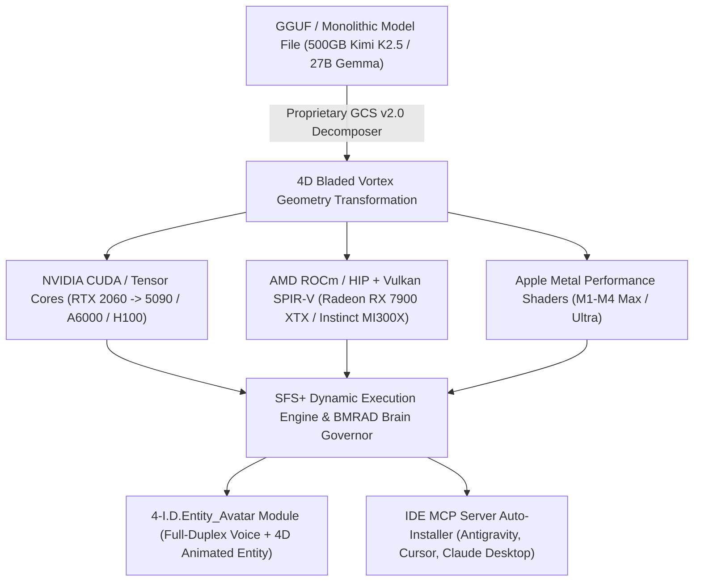

# HYPER-SPHERICAL SYSTEMS (HypeS) v4.1
## Official Feature Brochure, 4-I.D.Entity_Avatar Module & MCP Auto-Install Whitepaper

> **Empowering Next-Generation Autonomous AI Execution with Proprietary 4D Bladed Vortex Quantization, 4-I.D.Entity_Avatar Module (Real-Time Voice & 4D Entity), Universal IDE MCP Auto-Installation, and Zero-Knowledge Security.**

---

### 1. Executive Summary & Blueprint Reference

Hyper-Spherical Systems (HypeS) revolutionizes local and enterprise AI deployment by replacing legacy matrix multiplication and lossy quantization with **proprietary 4D Bladed Vortex Geometry** and **proprietary SISSI Codebook Indexing**. 

SFS (Spherical Function System) and SFS+ models execute completely standalone on any host machine — requiring zero third-party runtimes, python environments, or external container wrappers.

- **In-Depth Technical Blueprint:** For detailed mathematical proofs on AST minification, entropy pruning, index proxy mapping, and homophonic payload security, refer to the included technical reference:
  👉 [Tokenization & Compression Blueprint (PDF)](file:///i:/workspace/hyper_spherical/docs/tokenization_compression_blueprint.pdf)

---

### 2. Auto-Installation of HypeS CCTM MCP Server

> **"Seamless 1-Click MCP Auto-Installation during Onboarding & Setup."**

During the onboarding wizard (`hypes_installer_gui.py` / `onboarding_wizard`), users are provided with an interactive opt-in prompt:
- **`[x] Auto-install HypeS CCTM MCP Server into IDE Registries`**

When enabled, the installer automatically generates and registers `hypes-cctm.json` across all active IDE environments:
1. **Antigravity IDE:** `~/.gemini/config/mcp/hypes-cctm.json`
2. **Cursor IDE:** `~/.cursor/mcp.json`
3. **Claude Desktop:** `~/.config/Claude/claude_desktop_config.json`

This gives developer applications instant access to **HypeS 10x Token Compression**, live session management, and SISSI 5+1 zero-knowledge homophonic encryption directly inside their IDE toolbelt!

---

### 3. Module 7: 4-I.D.Entity_Avatar Module (Real-Time Voice & 4D Entity)

- **Natural Language Procedural Entity Generation:** Describe any entity in natural language (Human, Anime, Cartoon, Creature) to instantly render a custom interactive 4D avatar.
- **Native Full-Duplex Real-Time Voice (STT + TTS):** Built-in native speech understanding and text-to-speech synthesis with zero local file recording. Speak directly to your model, and it speaks back with synchronized lip-syncing (viseme mapping).
- **Procedural 4D Skeleton Animations:** Avatars dynamically walk, gesture, and interact with virtual objects — including walking over to a virtual file cabinet when searching local documents!
- **Flexible Hardware Offloading (2GB Memory Notice):**
  - **Dedicated Discrete GPU (NVIDIA / AMD):** 60+ FPS rendering (~2GB VRAM).
  - **Integrated Onboard iGPU (Intel Iris / AMD Radeon iGPU):** Offloads the 2GB avatar footprint from the primary gaming GPU to the integrated iGPU!
  - **System RAM Offload (CPU Engine):** Offloads avatar rendering to System RAM, keeping dedicated GPU VRAM 100% available for LLM inference!

---

### 4. SFS vs. SFS+ Licensing & Add-On Module Store

| Module Name | Tier / Status | Key Functionality & Impact |
| :--- | :--- | :--- |
| **SFS Core Base Engine** | Included Base | Standalone single-file binary, fixed 5GB security sandbox, 1 cloud model backpack. |
| **SFS+ Interoperability Bus (`MODULE_SFS_PLUS_INTEROP`)** | Enterprise Add-On ($79) | Cross-model VMoE expert harvesting (`harvest_virtual_expert`), 1GB VRAM budget pipes. |
| **4-I.D.Entity_Avatar Module (`MODULE_4IDENTITY_AVATAR`)** | Enterprise Add-On ($59) | Real-time full-duplex voice (STT/TTS), lip-sync visemes, 4D animated entity offload. |
| **BMRAD Brain Governor (`MODULE_BMRAD`)** | Enterprise Add-On ($49) | Brain Realignment & Attention Director, anti-loop recovery, multi-architecture governor. |
| **10x CCTM Compression (`MODULE_CCTM_ULTRA`)** | Enterprise Add-On ($19) | 4-Pillar Token Efficiency Suite (AST minification, entropy pruning, delta sync). |
| **Golden Candy Spinner (`MODULE_GCS`)** | Enterprise Add-On ($29) | Monolithic GGUF to 4D Bladed Vortex SFS/SFS+ model decomposer. |
| **SISSI 5+1 Cipher (`MODULE_CIPHER`)** | Enterprise Add-On ($19) | Zero-knowledge homophonic unicode scrambling + ChaCha20-Poly1305. |
| **All-Module Lifetime Bundle (`MODULE_ALL_BUNDLE`)** | Best Value ($149) | All modules unlocked forever with zero recurring subscriptions. |

---

### 5. Multi-Vendor GPU Hardware Acceleration & Resizable BAR (ReBAR)

- **PCIe Resizable BAR (ReBAR) Support:** Dynamically expands PCIe transfers from legacy 256MB windows up to 100% GPU VRAM aperture (`⚡ PCIe Resizable BAR: ENABLED (Full Aperture 10,240 MB Resized)`).
- **AMD ROCm / HIP & Vulkan SPIR-V:** Maps 4D Bladed Vortex Math directly to AMD Matrix Core Accelerators across AMD Instinct MI300X (192GB VRAM), MI250X (128GB), and Radeon RX 7900 XTX (24GB).
- **NVIDIA & Apple Metal Support:** Full coverage from consumer RTX 2060 to RTX 5090, RTX A6000, 6000 Ada, H100, B200, and Apple M1-M4 Ultra.

---

### 6. Competitive Superiority Matrix

| Feature / Dimension | Hyper-Spherical (HypeS SFS+) | Ollama / llama.cpp | vLLM / Anyscale | OpenAI Enterprise API | DeepSeek MoE |
| :--- | :--- | :--- | :--- | :--- | :--- |
| **IDE MCP Auto-Installation** | **Native 1-Click Onboarding Auto-Install** | None | None | None | None |
| **4-I.D.Entity_Avatar (Voice + 4D)** | **Native 4D Animated Entity & Voice (STT/TTS)** | None | None | Web interface only | None |
| **Hardware Offload Options** | **Dedicated GPU / iGPU / System RAM Offload** | GPU or CPU only | GPU only | Cloud Billed | GPU Cluster |
| **LM Studio / Unsloth Interop** | **Native OpenAI Endpoint (/v1/chat/completions)** | Standard API | Standard API | Cloud Only | Custom Client |
| **GPU Hardware Support** | **NVIDIA CUDA + AMD ROCm/HIP + Apple Metal** | CUDA / Metal (AMD limited) | NVIDIA CUDA Only | Cloud Managed | NVIDIA CUDA Only |
| **Quantization Loss** | **Zero-Loss ($<0.01^\circ$ Angular Error)** | High (4-bit/2-bit K-quants lose precision) | Moderate (AWQ / FP8 loss) | Proprietary Server | High Loss in quantized setups |
| **Extreme Compression** | **10x–20x Scale Reduction (500GB -> 50GB)** | Fails at extreme ratios | Fails at extreme ratios | Cloud Billed | Requires 8x H100 GPU cluster |
| **Brain Model Governor** | **Native BMRAD (Multi-Architecture Picker)** | None | None | Proprietary Server | Custom Routing Code |
| **Execution Environment** | **Standalone Single-File Binary** | Requires Ollama Daemon / CLI | Requires Python / PyTorch / CUDA | External API | Ray / Kubernetes Cluster |
| **Data Privacy & Security** | **100% Zero-Knowledge Homophonic Cipher** | Local plain-text only | Plain-text local server | Third-party cloud exposure | Third-party cloud exposure |
